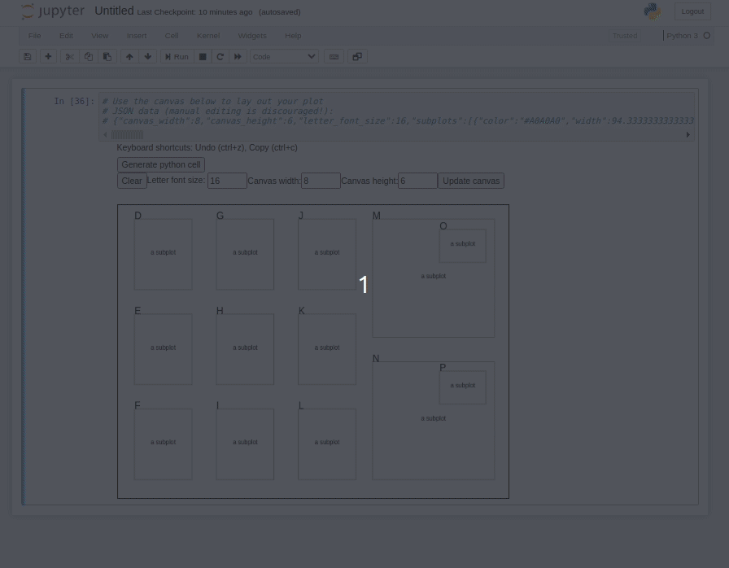

# figure-layout

This extension may be useful to matplotlib users who want to create intricate plot layouts, such as for scientific publications, which would normally be more convenient in a non-python graphical tool such as Inkscape or Photoshop. 

First, you have to create your layout. Below is a demo in GIF form, creating a mostly grid figure layout, with some inset plots.

Next, clean up all your labels and generate the python code/plot

